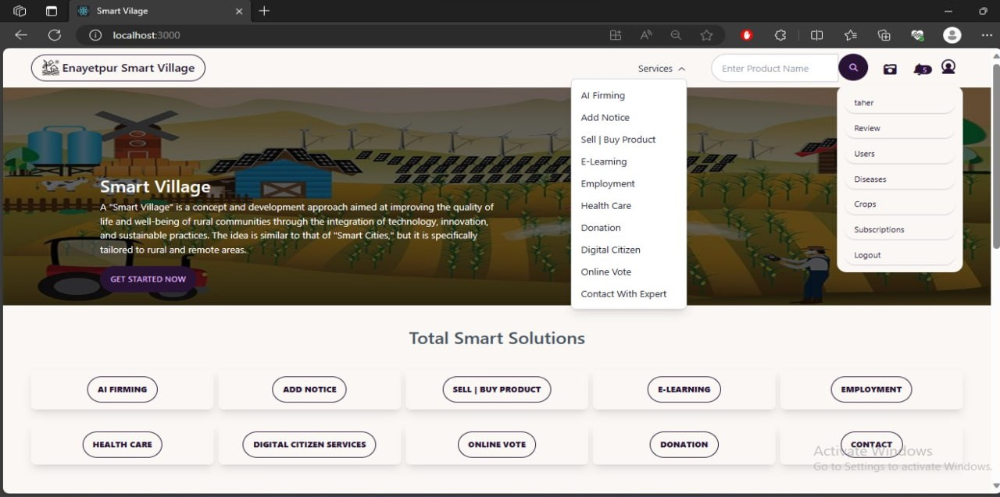
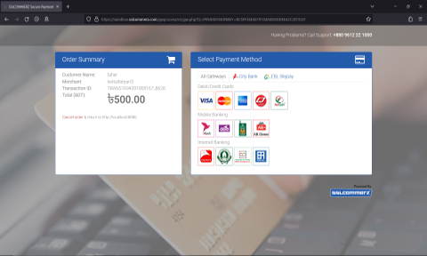
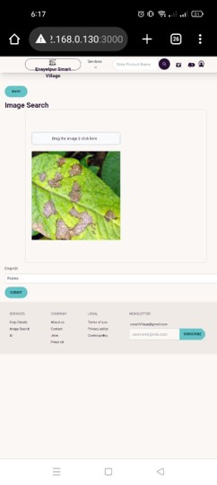
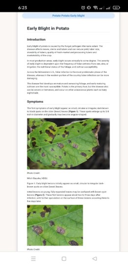
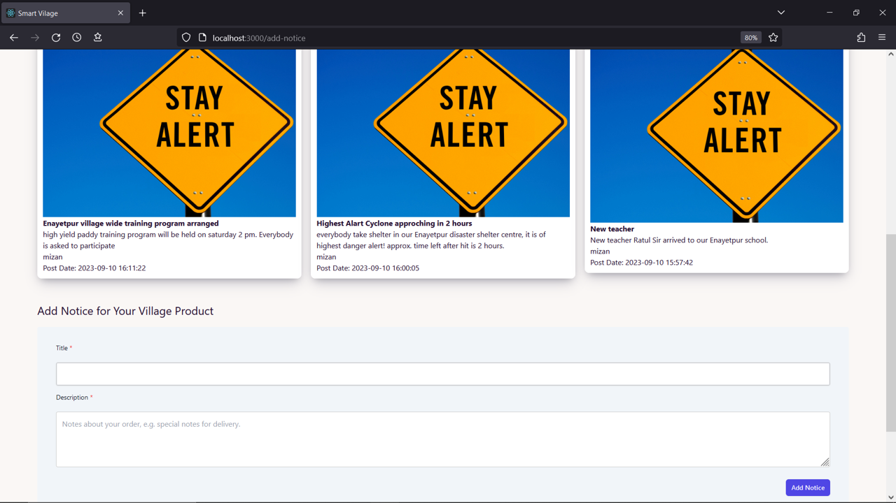
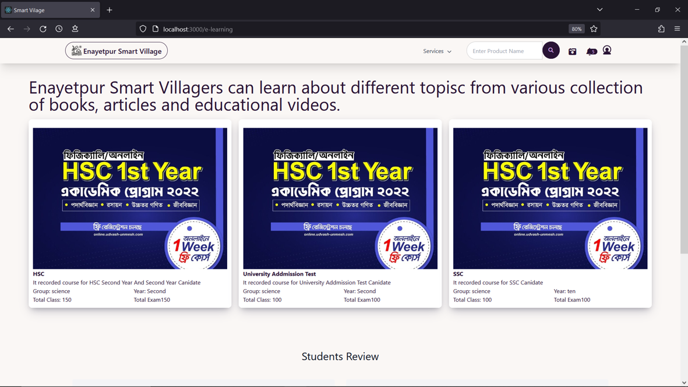
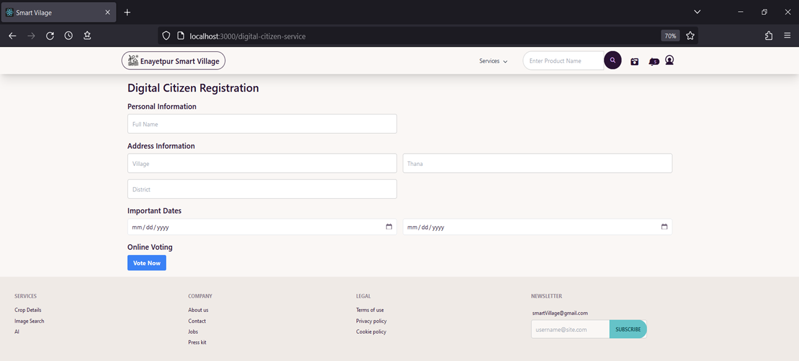
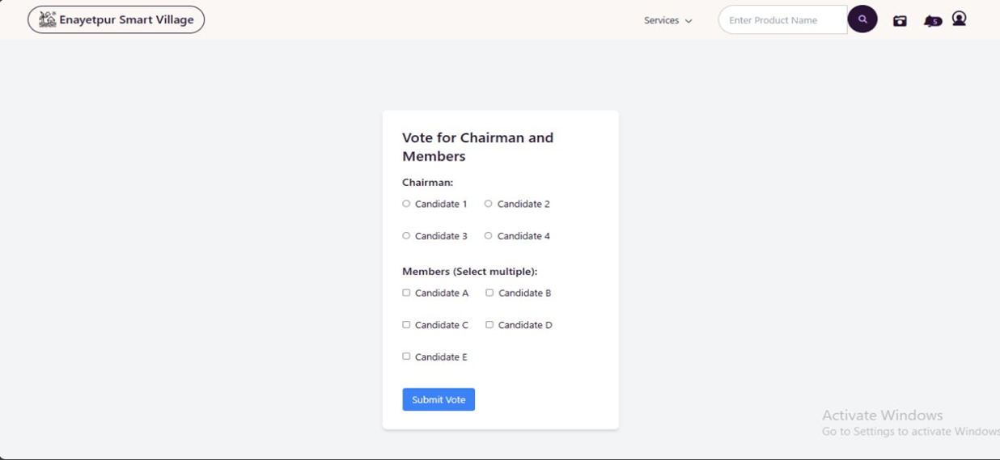
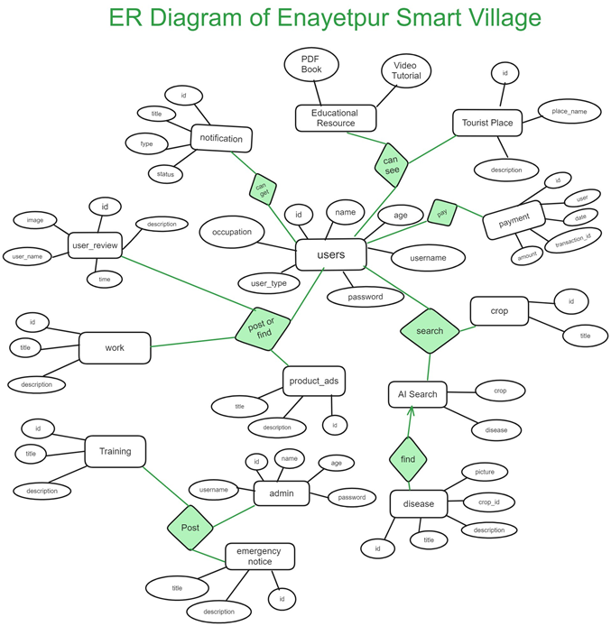
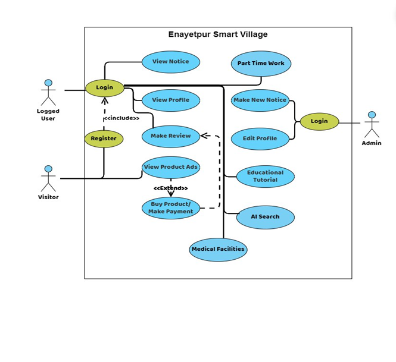

# Smart Village

The Smart Village project improves rural life by addressing challenges
such as limited crop management info, education, healthcare, markets,
exploitation and lack of training. It provides an online marketplace,
digital education, healthcare, crop management tips, notices, and a
voting system. It promotes employment, entrepreneurship, economic
development, skill training and community engagement.

## In rural areas like Enayetpur, Sirajganj, we addressed pressing challenges that hinder sustainable development:

🌾 Limited Access to the latest Crop Management Information which is developed with the latest research and technologies  
💼 Limited Economic Opportunities  
🏥 Inadequate Medical Facilities  
📚 Limited Access to Education  
🌱 Lack of Agricultural Training  
🌍 Limited Knowledge about Disease Prevention  
🛒 Limited Access to Markets  
🤝 Middlemen Exploitation  
📈 Market Information Gap  
🌐 Limited Information Sharing  
👫 Social Isolation and Limited Connectivity  
🌪️ Lack of Information for Natural Disasters  
🌪️ Improper Disaster Preparedness  

## Here's how we addressed these issues:

🛒 Enayetpur Online Marketplace  
💳 Online Payment with SSLCOMMERZ  
🆘 Emergency Notice  
🌱 Crop Management Tips  
🌾 Crop Disease Detection with AI  
📚 Digital Education  
🏥 Digital HealthCare Access  
📢 General Notices  
💼 Employment and Work  
🌳 Environmental Sustainability  
🚀 Rural Entrepreneurship and Economic Development  
📖 Skill Development and Training Programs  
🤝 Community Engagement  
🗳️ Village Chairman and Member Voting System  

## Our solution is designed for real-world impact:

🔧 Implementation:  
  - Java Spring Boot on the backend, MySQL database, React frontend  
🔐 Data Security:  
  - Ensured secure data storage and handling in MySQL databases  
🌐 User-Centered Design:  
  - User-friendly interface and scalable for both mobile and computers  
💰 Secure Online Payment:  
  - Integrated SSLCOMMERZ payment gateway

## Online Village Marketplace

## SSLCOMMERZ Payment Gateway

## Checking Crop Health with Artificial Intelligence support

|  |  |
| -------------------------------------------------------- | -------------------------------------------------------- |

## Online Notice System

1. Notice about training programs

2. Notice for most updated crop management tips with latest research and technology.

3. Emergency notice for natural disaster alerts and safe shelter locations.

4. Notification system for all the notices.

## Educational Resources

## Connect with doctors during Emergency

## Government related service processes made easy

## Village Chairman Voting System

## Entity Relationship diagram

## Simplified Use-Case diagram

